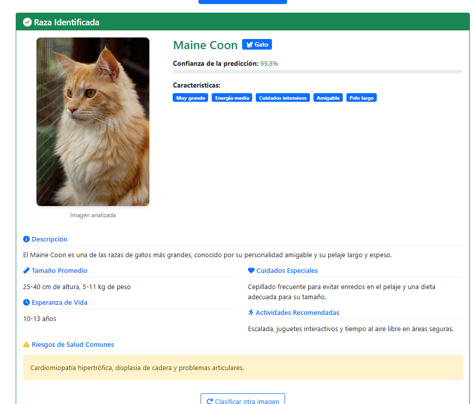
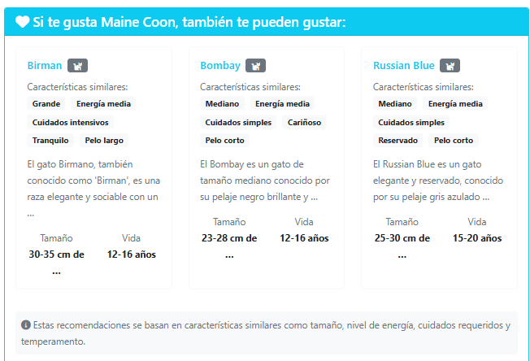
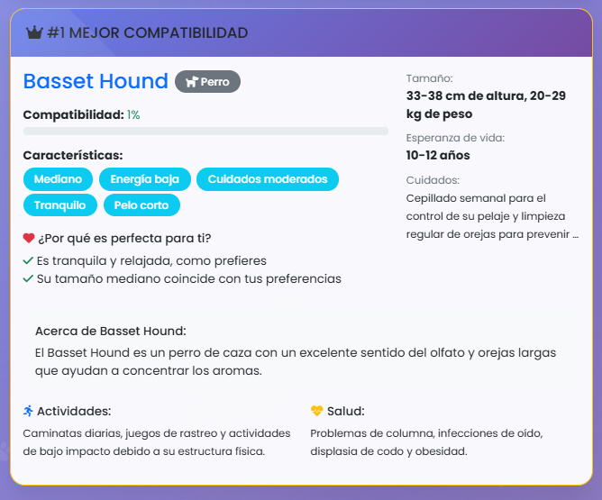

# 🐾 Clasificador Inteligente de Mascotas del Hogar

Un sistema web completo desarrollado en **Django** que utiliza **inteligencia artificial** para identificar razas de mascotas y proporcionar **recomendaciones personalizadas** basadas en el estilo de vida del usuario.

---

## ✨ Características Principales
### 🤖 Detalles del Modelo de entrenado con iceptionv3
#### 🧠 Arquitectura
- **Base**: InceptionV3 preentrenado  
- **Entrada**: Imágenes 299x299 RGB  
- **Salida**: 37 clases (25 perros, 12 gatos)  
- **Precisión**: >90% en validación  

#### 📦 Conjunto de datos
- **Fuente**: Oxford-IIIT Pet Dataset.  
- **Total**: ~7,400 imágenes  
- **Preprocesamiento**: redimensionado, normalización, aumento de datos
### 🔍 Clasificador de Razas con IA
- Identifica **37 razas** diferentes (25 perros + 12 gatos).
- Modelo **InceptionV3** entrenado con el conjunto de datos **Oxford-IIIT**.
- Confianza mínima del **89%%** para mostrar resultados.
- Interfaz intuitiva con carga de imágenes.
- Muestra **información detallada** de cada raza identificada.

📸 ****

---

### 🧠 Sistema de Recomendaciones Inteligentes
- Algoritmo basado en **similitud de características**.
- Sugiere **3 razas similares** a la detectada.
- Considera:
  - Tamaño
  - Nivel de energía
  - Cuidados
  - Temperamento
  - Tipo de pelo

📎 Las recomendaciones incluyen una **explicación personalizada**.
📸 ****
---

### 📝 Cuestionario de Compatibilidad
- **9 preguntas** sobre estilo de vida y preferencias.
- Algoritmo de puntuación avanzado considera:
  - Tipo de vivienda
  - Tiempo disponible
  - Presencia de niños o mascotas
  - Experiencia previa

🎯 Muestra las **3 razas más compatibles** con el usuario y la **razón de la recomendación**.

📸 ****

---


## 🛠️ Tecnologías Utilizadas

| Categoría        | Tecnologías                         |
|------------------|-------------------------------------|
| Backend          | Django 5.1.2                        |
| IA/ML            | TensorFlow 2.12.0, Keras 2.12.0     |
| Imagen           | Pillow, NumPy                      |
| Frontend         | HTML5, CSS3, JavaScript, Bootstrap 5 |
| Base de datos    | SQLite (modo desarrollo)            |
| Íconos           | Font Awesome 6                      |

---

## 📋 Requisitos del Sistema

- Python 3.8+
- Mínimo 4 GB de RAM (recomendado: 8 GB)
- 2 GB de espacio libre
- Navegador moderno (Chrome, Firefox, Edge)

---

## 🚀 Instalación

### 1. Clonar el repositorio

```bash
git clone https://github.com/alex-raul/clasificador-de-mascotas-.git


### 2. Crear entorno virtual

```bash
# Windows
python -m venv venv
venv\Scripts\activate

# 3. Instalar dependencias
pip install -r requirements.txt

# 4. Configurar Django
python manage.py migrate

# 5. ejecutar el servidor
python manage.py runserver

